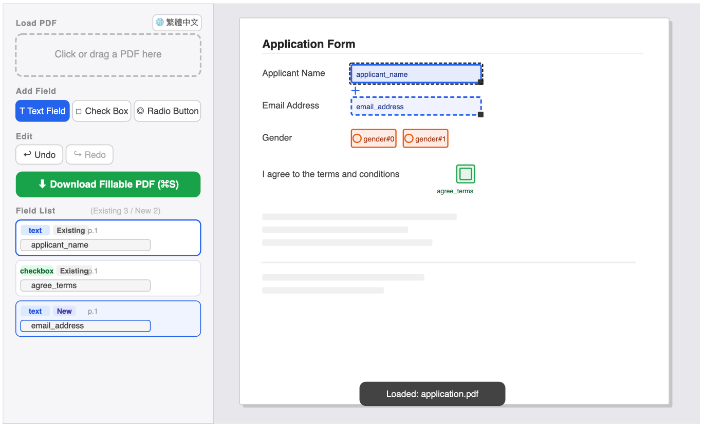

# PDF Fillable Editor

[](LICENSE)
[](https://pdf.mingodev.com)
[](https://pdf.mingodev.com)
[](https://pdf.mingodev.com)

A lightweight, zero-install browser tool that turns any static PDF into a fillable form — draw text fields, checkboxes, and radio buttons directly onto the page, entirely client-side, no server required.

<p align="center">
  
</p>

## Features

- **Make any PDF fillable** — punch text fields, checkboxes, and radio buttons into any existing PDF with a simple drag-and-draw
- **Edit existing fillable fields** — load a PDF that already has AcroForm fields; reposition, resize, or rename them in-place
- **Inline name editing** — double-click any field box on the PDF to rename it without leaving the canvas
- **Radio button groups** — assign radio buttons to named groups; customize the group name before drawing
- **Undo / Redo** — full history with up to 50 snapshots; keyboard shortcuts `⌘Z` / `⌘⇧Z` (or `Ctrl+Z` / `Ctrl+Shift+Z`)
- **Download with one click** — exports a standards-compliant fillable PDF with all AcroForm fields embedded; shortcut `⌘S`
- **Bilingual UI** — switch between Traditional Chinese and English at any time with the globe toggle
- **Drag-and-drop upload** — drag a PDF onto the upload area or click to browse
- **No data leaves your machine** — everything runs in the browser using pdf.js (rendering) and pdf-lib (read/write)

## Supported Field Types

| Type | Badge colour | Use case |
|---|---|---|
| Text Field | Blue | Names, addresses, free-form answers |
| Check Box | Green | On/off toggles, multi-select options |
| Radio Button | Orange | Single-choice groups |

## Quick Start

1. Open `index.html` in any modern browser (Chrome, Firefox, Safari, Edge).
2. Drop a static PDF onto the upload area, or click it to browse.
3. Choose a field type from the toolbar (Text Field / Check Box / Radio Button).
4. Draw fillable fields onto the PDF page by clicking and dragging.
5. Rename fields in the sidebar list or by double-clicking on the PDF canvas.
6. Click **Download** (or press `⌘S`) to save the fillable PDF.

> No build step, no npm install, no backend. Just open the file.

## Keyboard Shortcuts

| Shortcut | Action |
|---|---|
| `⌘Z` / `Ctrl+Z` | Undo |
| `⌘⇧Z` / `Ctrl+Shift+Z` | Redo |
| `⌘S` / `Ctrl+S` | Download modified PDF |

## Dependencies (CDN, no install)

| Library | Version | Purpose |
|---|---|---|
| [pdf.js](https://mozilla.github.io/pdf.js/) | 3.11.174 | Render PDF pages to canvas |
| [pdf-lib](https://pdf-lib.js.org/) | 1.17.1 | Read & write AcroForm fields |

Both libraries are loaded from public CDNs. For offline use, download them and update the `<script src="...">` tags in the HTML.

## How It Works

1. **Load** — pdf-lib reads any existing AcroForm fields from the PDF; pdf.js renders each page to a `<canvas>`.
2. **Draw** — field overlays are absolutely-positioned `<div>` elements on top of the canvas. Drag to place a fillable field, drag the resize handle to resize, double-click to rename.
3. **Export** — pdf-lib rebuilds the AcroForm: existing fields are updated in-place (moved, resized, renamed, or removed); newly drawn fields are embedded as fresh AcroForm widgets. The result is a fully fillable PDF, downloaded directly to your device.

## File Structure

```
index.html   — single-file app (HTML + CSS + JS, ~980 lines)
README.md    — this file
```

## Browser Compatibility

Any browser that supports the Canvas API and ES2020+ (all modern evergreen browsers). Internet Explorer is not supported.

## License

MIT
